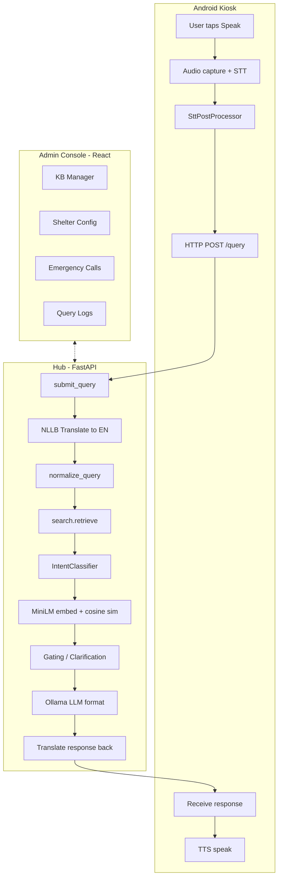

<a id="readme-top"></a>

<br />
<div align="center">
  <a href="https://github.com/keithruezyl1/ResKiosk-">
    
  </a>

<h3 align="center">ResKiosk</h3>

  <p align="center">
    An offline-first, voice-powered information kiosk system for disaster shelters and evacuation centers.
    <br />
    <a href="docs/"><strong>Explore the docs »</strong></a>
    <br />
    <br />
    <a href="docs/PIPELINE_END_TO_END.md">Pipeline Docs</a>
    &middot;
    <a href="docs/TESTING_MULTILINGUAL.md">Testing Guide</a>
    &middot;
    <a href="docs/openapi.yaml">API Spec</a>
  </p>
</div>

---

<details>
  <summary>Table of Contents</summary>
  <ol>
    <li>
      <a href="#about-the-project">About The Project</a>
      <ul>
        <li><a href="#key-features">Key Features</a></li>
        <li><a href="#architecture-overview">Architecture Overview</a></li>
        <li><a href="#built-with">Built With</a></li>
      </ul>
    </li>
    <li>
      <a href="#getting-started">Getting Started</a>
      <ul>
        <li><a href="#prerequisites">Prerequisites</a></li>
        <li><a href="#one-click-setup">One-Click Setup</a></li>
        <li><a href="#manual-setup">Manual Setup</a></li>
        <li><a href="#android-kiosk-setup">Android Kiosk Setup</a></li>
      </ul>
    </li>
    <li>
      <a href="#system-components">System Components</a>
      <ul>
        <li><a href="#hub-python-backend">Hub (Python Backend)</a></li>
        <li><a href="#kiosk-android-app">Kiosk (Android App)</a></li>
        <li><a href="#console-admin-dashboard">Console (Admin Dashboard)</a></li>
      </ul>
    </li>
    <li><a href="#voice-pipeline">Voice Pipeline</a></li>
    <li><a href="#semantic-search--intent-classification">Semantic Search &amp; Intent Classification</a></li>
    <li><a href="#emergency-system">Emergency System</a></li>
    <li><a href="#rlhf-feedback-loop">RLHF Feedback Loop</a></li>
    <li><a href="#multilingual-support">Multilingual Support</a></li>
    <li><a href="#api-reference">API Reference</a></li>
    <li><a href="#model-configuration">Model Configuration</a></li>
    <li><a href="#github-actions-secrets">GitHub Actions Secrets</a></li>
    <li><a href="#performance-benchmarks">Performance Benchmarks</a></li>
    <li><a href="#project-structure">Project Structure</a></li>
    <li><a href="#documentation">Documentation</a></li>
    <li><a href="#top-collaborators">Top Collaborators</a></li>
    <li><a href="#acknowledgments">Acknowledgments</a></li>
  </ol>
</details>

---

## About The Project

**ResKiosk** is a complete offline-first voice-powered kiosk system designed for disaster shelters, evacuation centers, and humanitarian aid sites. It enables displaced individuals to ask questions by voice in their native language and receive spoken answers about food schedules, medical services, registration, sleeping arrangements, and more — all without requiring internet connectivity.

The system consists of three core components:

| Component | Description |
|-----------|-------------|
| **Hub** | Python/FastAPI backend running semantic search, translation, LLM formatting, and a SQLite knowledge base |
| **Kiosk** | Android tablet app with offline speech-to-text, text-to-speech, and emergency detection |
| **Console** | React web dashboard for shelter operators to manage KB articles, shelter config, emergency alerts, and logs |

All AI models run locally. The hub, kiosks, and console communicate over a LAN — no cloud dependency required.

<p align="right">(<a href="#readme-top">back to top</a>)</p>

### Key Features

- **Fully Offline Voice Pipeline** — Speak in 5 languages, get answers spoken back. No internet needed.
- **Semantic Knowledge Base Search** — MiniLM embeddings + cosine similarity with intent-enriched queries.
- **Prototype-Based Intent Classification** — 23 intent labels with automatic query enrichment and short-circuit responses.
- **LLM-Powered Response Formatting** — Ollama (Llama 3.2 / Gemma) reformats KB articles into conversational answers.
- **Real-Time Emergency Alerts** — Voice keyword detection, SOS button, tiered alert lifecycle, SSE broadcast to console.
- **RLHF-Style Retrieval Bias** — Thumbs up/down feedback shifts article ranking over time.
- **Multilingual Translation** — Facebook NLLB-200 translates queries and responses between 5 languages.
- **Admin Console** — Full CRUD for KB, shelter config with freshness enforcement, emergency management, query logs, and network setup.
- **Shelter Config Freshness** — Mandatory weekly review per section with blocking modals for expired data.
- **Inventory Tracking** — Rule-based shortcut for supply questions (water, food, blankets) with real-time stock data.

<p align="right">(<a href="#readme-top">back to top</a>)</p>

### Architecture Overview



<p align="right">(<a href="#readme-top">back to top</a>)</p>

### Built With

**Kiosk (Android)**

[![Kotlin][Kotlin-badge]][Kotlin-url]
[![Jetpack Compose][Compose-badge]][Compose-url]
[![Android][Android-badge]][Android-url]

- **Sherpa-ONNX** — Offline STT (Zipformer for en/ja, Whisper for es/de/fr) and TTS (VITS)
- **Google ML Kit** — On-device translation fallback
- **Retrofit** — HTTP client for Hub communication

**Hub (Backend)**

[![Python][Python-badge]][Python-url]
[![FastAPI][FastAPI-badge]][FastAPI-url]
[![SQLite][SQLite-badge]][SQLite-url]

- **Sentence-Transformers** — MiniLM-L6-v2 for semantic embeddings
- **Facebook NLLB-200** — Multilingual translation (600M distilled)
- **Ollama** — Local LLM (Llama 3.2:3b, translategemma:4b)
- **SQLAlchemy** — ORM for KB, config, logs, and emergency data
- **PyInstaller** — Standalone `.exe` packaging

**Console (Admin Dashboard)**

[![React][React-badge]][React-url]
[![Vite][Vite-badge]][Vite-url]

- **React Router v6** — SPA navigation
- **Axios** — API client
- **Lucide React** — Icon system
- **QRCode.react** — Network QR code display

<p align="right">(<a href="#readme-top">back to top</a>)</p>

---

## Getting Started

### Prerequisites

| Requirement | Version | Notes |
|-------------|---------|-------|
| **Python** | 3.10+ | For Hub backend |
| **Node.js** | 18+ | For building the admin console |
| **Android Studio** | Latest | For building/deploying the Kiosk app |
| **RAM** | 16 GB+ recommended | Local LLM + embeddings + translation models |
| **Disk** | 15 GB+ free | Model weights (~6.5 GB total) + build artifacts |

### One-Click Setup

Run the scripts inside `TO RUN/` **in order** from the project root:

```powershell
# 1. Install Python + Node dependencies, build admin console
.\TO RUN\01_install_deps.bat

# 2. Download all AI models (MiniLM, NLLB-200, Ollama LLMs)
.\TO RUN\02_download_models.bat

# 3. Start the Hub (runs in background, logs to hub.log)
.\TO RUN\start_hub.vbs
```

After startup, open **http://localhost:8000** to access the admin console.

### Manual Setup

```bash
# Create virtual environment
python -m venv venv
venv\Scripts\activate

# Install Python dependencies
pip install -r requirements.txt

# Build admin console
cd console && npm install && npm run build && cd ..

# Download AI models
python packaging\bundle_models.py

# Start the Hub
python -m hub.launcher
# Or: uvicorn hub.main:app --host 0.0.0.0 --port 8000
```

### Android Kiosk Setup

1. Open the `kiosk/` folder in Android Studio.
2. Download STT/TTS model files and place them in `kiosk/app/src/main/assets/` (see [Kiosk README](kiosk/README.md) for model file details).
3. Build and deploy to an Android tablet.
4. In the app, configure the **Hub URL** (e.g. `http://<Hub-IP>:8000`) under Hub Connection.
5. The kiosk auto-registers with the Hub and appears in the console's Network Setup page.

> **Tip:** You can scan the QR code from the console's Network Setup page to configure the Hub URL.

### Building the Standalone Executable

```bash
pyinstaller packaging/reskiosk-hub.spec
# Output: dist/ResKiosk-Hub/ResKiosk-Hub.exe
```

<p align="right">(<a href="#readme-top">back to top</a>)</p>

---

## System Components

### Hub (Python Backend)

The Hub is the central intelligence server. It handles:

- **Query Processing** — Receives transcripts from kiosks, translates, normalizes, retrieves answers, formats with LLM, translates back.
- **Knowledge Base** — SQLite-backed articles with categories, tags, and embeddings. Full CRUD via admin API.
- **Shelter Configuration** — Structured config for food schedules, sleeping zones, medical stations, registration steps, announcements, and inventory. Freshness enforcement (7-day expiry per section).
- **Emergency Management** — Receives kiosk alerts, broadcasts via SSE, tracks full lifecycle (Active → Acknowledged → Responding → Resolved).
- **Session Management** — Per-kiosk session history, query logging with intent/score/latency, feedback storage.
- **Model Hosting** — Loads MiniLM (embeddings), NLLB-200 (translation), and orchestrates Ollama (LLM).

**Entry Points:**
- `hub/main.py` — FastAPI app, model prewarming, static console serving
- `hub/launcher.py` — Ollama + Uvicorn orchestrator

### Kiosk (Android App)

The Kiosk is the user-facing tablet application. It provides:

- **Voice Interaction** — Tap-to-speak with ring buffer pre-capture, real-time streaming transcript (en/ja) or batch decode (es/de/fr).
- **STT Post-Processing** — Filler removal, duplicate collapse, fuzzy domain correction, phrase/word maps, punctuation injection.
- **Text Input** — Optional keyboard mode alongside voice.
- **Emergency Detection** — Tier 1 (immediate phrases with 10s cancel) and Tier 2 (keywords with 20s auto-confirm). Manual SOS with hold-to-confirm.
- **Intonation Analysis** — Question vs. statement detection from audio and transcript features.
- **Feedback** — Thumbs up/down on responses with automatic retry on dislike.
- **Two Chat Modes** — Voice-Only (assistant bubbles only, large mic button) and Text+Voice (full chat with keyboard toggle).

### Console (Admin Dashboard)

The Console is a React SPA served by the Hub at `http://localhost:8000`. Pages include:

| Page | Purpose |
|------|---------|
| **Dashboard** | Hub ID, KB version, emergency mode toggle |
| **KB Viewer** | Browse and search knowledge base articles |
| **FAQ Manager** | Full CRUD for KB articles with categories and tags |
| **Shelter Config** | Structured config editor with inventory table and freshness enforcement |
| **Network Setup** | Hub URL display, QR code, connected kiosks with editable names |
| **Emergency Calls** | Real-time active alerts (SSE), acknowledge/respond/resolve workflow, history with CSV export |
| **Query Tracker** | Live query log stream with filters |
| **Logs Viewer** | Hub log viewer |
| **Hub Messages** | System messages and notifications |

<p align="right">(<a href="#readme-top">back to top</a>)</p>

---

## Voice Pipeline

The full speech-to-response pipeline runs entirely offline:

```
User speaks → Audio capture (ring buffer) → STT decode → Post-processing → Emergency check
    → HTTP POST /query → NLLB translate to EN → Normalize → Intent classify → Enrich query
    → MiniLM embed → Cosine similarity search → Gating → Ollama LLM format → NLLB translate back
    → HTTP response → Chat bubble + TTS speak
```

### Key Pipeline Stages

| Stage | Component | Details |
|-------|-----------|---------|
| **Audio Capture** | `AudioRecorder.kt` | 16 kHz, ring buffer (1.5s pre-capture), TTS bleed protection |
| **STT** | `SherpaSttEngine` | Zipformer streaming (en/ja), Whisper batch (es/de/fr) |
| **Post-Processing** | `SttPostProcessor.kt` | 9 correction passes: dedup, fillers, time normalization, fuzzy domain, phrase/word maps, punctuation |
| **Translation** | `translator.py` (NLLB-200) | Bidirectional: user language → EN for search, EN → user language for response |
| **Normalization** | `normalizer.py` | Lowercase, dedup, domain corrections, language-specific synonyms |
| **Intent Classification** | `intent.py` | 23 prototype-based intents, cosine similarity centroids, top-2 enrichment |
| **Semantic Search** | `search.py` | MiniLM-L6-v2 embeddings, cosine similarity, top-5 retrieval |
| **Query Rewrite** | `rewriter.py` | Ollama Llama 3.2 cleans noisy transcripts for NO_MATCH/unclear cases |
| **Response Formatting** | `formatter.py` | Ollama reformats KB articles into 2-4 conversational sentences |
| **TTS** | `SherpaTtsEngine` | VITS-based per-language acoustic models |

For the complete pipeline walkthrough with code references, see [Pipeline End-to-End](docs/PIPELINE_END_TO_END.md).

<p align="right">(<a href="#readme-top">back to top</a>)</p>

---

## Semantic Search & Intent Classification

### Retrieval Pipeline

1. **Direct Config Match** — Exact key lookup in structured config (instant).
2. **Inventory Shortcut** — Regex-based supply queries answered from shelter stock data.
3. **Intent Classification** — Prototype embeddings per intent, cosine similarity to centroids.
4. **Short-Circuit** — Greeting, identity, capability, small_talk, goodbye return static responses without KB lookup.
5. **Query Enrichment** — Intent keywords appended to search query (supports dual-intent enrichment).
6. **Vector Search** — MiniLM-L6-v2 embedding → cosine similarity against KB article matrix.
7. **RLHF Bias** — Optional score adjustment from historical feedback.
8. **Gating** — Score ≥ 0.60 → DIRECT_MATCH | 0.40–0.60 → NEEDS_CLARIFICATION | < 0.40 → NO_MATCH.

### 23 Supported Intents

`greeting` · `identity` · `capability` · `small_talk` · `food` · `medical` · `registration` · `sleeping` · `transportation` · `safety` · `facilities` · `lost_person` · `pets` · `donations` · `hours` · `location` · `general_info` · `goodbye` · `inventory` · `mental_health` · `legal_docs` · `financial_aid` · `hygiene` · `departure` · `children` · `special_needs`

### Tunable Thresholds (Environment Variables)

| Variable | Default | Purpose |
|----------|---------|---------|
| `RESKIOSK_SIM_THRESHOLD` | `0.60` | English direct-match threshold |
| `RESKIOSK_CLARIFICATION_FLOOR` | `0.40` | English clarification threshold |
| `RESKIOSK_NON_EN_SIM_THRESHOLD` | `0.50` | Non-English direct-match threshold |
| `RESKIOSK_NON_EN_CLARIFICATION_FLOOR` | `0.38` | Non-English clarification threshold |

For full details, see [Intent Classification](docs/intent-classification.md).

<p align="right">(<a href="#readme-top">back to top</a>)</p>

---

## Emergency System

ResKiosk includes a complete emergency alert lifecycle across all three components:

### Detection (Kiosk)
- **Tier 1** — Immediate trigger phrases with 10-second cancel window
- **Tier 2** — Keyword confirmation with 20-second auto-confirm countdown
- **Manual SOS** — Hold-to-confirm button (3-second press) bypasses confirmation

### Lifecycle
```
Detection → POST /emergency → ACTIVE → ACKNOWLEDGED → RESPONDING → RESOLVED
                                  ↓
                            DISMISSED (false alarm)
```

### Hub Endpoints
- `POST /emergency` — Create alert (deduplicates by `alert_id_local`)
- `GET /emergency/stream` — SSE stream for real-time console updates
- `GET /emergency/active` — Active alerts sorted by tier and timestamp
- `PATCH /emergency/{id}/acknowledge` — Mark acknowledged
- `PATCH /emergency/{id}/responding` — Mark responding
- `POST /emergency/{id}/resolve` — Resolve with notes

### Dashboard Emergency Mode
Operators can activate shelter-wide emergency mode from the Dashboard. Kiosks receive the state via polling and display full-screen overlays with alarm audio.

For the full specification, see [Emergency Calls](docs/emergency-calls.md).

<p align="right">(<a href="#readme-top">back to top</a>)</p>

---

## RLHF Feedback Loop

ResKiosk implements an **RLHF-style retrieval bias layer** (not full model fine-tuning):

1. **Feedback Capture** — Users give thumbs up (+1) or thumbs down (-1) on responses.
2. **Immediate Effect** — Dislike triggers silent retry excluding the previous article.
3. **Bias Rebuild** — Periodic offline job converts feedback into per-article bias scores using log-ratio smoothing.
4. **Retrieval Adjustment** — `adjusted_score = raw_cosine + (RLHF_ALPHA * bias)`, shifting article ranking over time.

| Variable | Default | Purpose |
|----------|---------|---------|
| `RESKIOSK_RLHF_ENABLED` | `false` | Enable bias scoring |
| `RESKIOSK_RLHF_ALPHA` | `0.10` | Bias weight in score adjustment |
| `RESKIOSK_RLHF_BIAS_TTL_SECS` | `1800` | In-memory bias cache TTL |

For full details, see [RLHF](docs/rlhf.md).

<p align="right">(<a href="#readme-top">back to top</a>)</p>

---

## Multilingual Support

| Language | Code | STT Mode | STT Engine | Noise Suppression |
|----------|------|----------|------------|-------------------|
| English | `en` | Streaming | Zipformer | Yes |
| Japanese | `ja` | Streaming | Zipformer | Yes |
| Spanish | `es` | Batch | Whisper | No (better raw) |
| German | `de` | Batch | Whisper | No (better raw) |
| French | `fr` | Batch | Whisper | No (better raw) |

- **Streaming languages** show live transcript as user speaks.
- **Batch languages** show "Listening..." then final transcript on release.
- **Translation** uses NLLB-200-distilled-600M for query→EN and EN→response language.
- **Hub normalization** includes language-specific synonym mappings for es/de/fr/ja.

All KB content is authored in English. Non-English queries are translated to English for search, and English responses are translated back to the user's language.

For testing procedures, see [Multilingual Testing Guide](docs/TESTING_MULTILINGUAL.md).

<p align="right">(<a href="#readme-top">back to top</a>)</p>

---

## API Reference

### Core Endpoints

| Method | Endpoint | Description |
|--------|----------|-------------|
| `POST` | `/query` | Submit user query (transcript, language, session) |
| `POST` | `/feedback` | Submit thumbs up/down feedback |
| `GET` | `/health` | System health check |
| `GET` | `/admin/ping` | Lightweight connectivity check (includes emergency mode state) |
| `GET` | `/network/info` | Hub IP and port |

### Knowledge Base

| Method | Endpoint | Description |
|--------|----------|-------------|
| `GET` | `/kb/version` | Current KB version |
| `GET` | `/kb/snapshot` | Full KB snapshot (articles + config) |
| `POST` | `/admin/article` | Create KB article |
| `PUT` | `/admin/article/{id}` | Update KB article |
| `DELETE` | `/admin/article/{id}` | Delete KB article |

### Emergency

| Method | Endpoint | Description |
|--------|----------|-------------|
| `POST` | `/emergency` | Create emergency alert |
| `GET` | `/emergency/stream` | SSE stream for real-time alerts |
| `GET` | `/emergency/active` | List active alerts |
| `PATCH` | `/emergency/{id}/acknowledge` | Mark acknowledged |
| `PATCH` | `/emergency/{id}/responding` | Mark responding |
| `POST` | `/emergency/{id}/resolve` | Resolve with notes |
| `GET` | `/emergency/history` | Resolved alerts with filters |

### Shelter Config

| Method | Endpoint | Description |
|--------|----------|-------------|
| `GET` | `/admin/config` | List all config keys |
| `GET` | `/admin/config/{key}` | Get config value |
| `PUT` | `/admin/config/{key}` | Update config value |
| `GET` | `/admin/evac/freshness` | Check section freshness status |
| `POST` | `/admin/evac/freshness/confirm` | Confirm sections up-to-date |

For the full OpenAPI spec, see [openapi.yaml](docs/openapi.yaml).

<p align="right">(<a href="#readme-top">back to top</a>)</p>

---

## Model Configuration

Hub LLM selection supports split formatter/rewriter models:

| Variable | Purpose | Default Fallback |
|----------|---------|------------------|
| `RESKIOSK_FORMAT_MODEL` | LLM for response formatting | `translategemma:4b` |
| `RESKIOSK_REWRITE_MODEL` | LLM for query rewriting | `llama3.2:3b` |
| `RESKIOSK_LLM_MODEL` | Legacy unified fallback | — |

### AI Models Used

| Model | Role | Size | Location |
|-------|------|------|----------|
| **all-MiniLM-L6-v2** | Sentence embeddings | ~80 MB | `packaging/hub_models/` |
| **NLLB-200-distilled-600M** | Translation (5 languages) | ~1.2 GB | `packaging/hub_models/` |
| **Llama 3.2:3b** | Query rewriting | ~2 GB | Ollama |
| **translategemma:4b** | Response formatting | ~2.5 GB | Ollama |
| **Zipformer** (en/ja) | Streaming STT | ~50 MB each | Kiosk assets |
| **Whisper** (es/de/fr) | Batch STT | ~150 MB each | Kiosk assets |
| **VITS** (per language) | TTS | ~20 MB each | Kiosk assets |

<p align="right">(<a href="#readme-top">back to top</a>)</p>

---

## GitHub Actions Secrets

For CI/CD workflows, add these secrets in **GitHub → Settings → Secrets and variables → Actions**:

| Secret Name | Required | How to Generate | Description |
|-------------|:--------:|------------------|-------------|
| `OPENAI_API_KEY` | If cloud enabled | [Get from OpenAI](https://platform.openai.com/api-keys) | API key for cloud STT/TTS/formatting (cloud is currently disabled) |
| `LORA_ENCRYPTION_KEY` | Optional | See below | AES-256-GCM key for hub-to-hub LoRa encryption (64 hex chars) |

### Generate `LORA_ENCRYPTION_KEY`

Run this command to generate a 64-character hex key:

```bash
python -c "import os; print(os.urandom(32).hex())"
```

Example output: `e37d8df18abed2ddc90806493121089dca85e91d35e586f442a084691bcde127`

> **Note:** All hubs in the network must share the same key. If not set, LoRa messages are sent in plaintext.

### Optional Environment Variables (for CI)

These can be set as repository variables (not secrets) if your workflow needs them:

| Variable | Default | Use in CI |
|----------|---------|-----------|
| `RESKIOSK_DB_PATH` | Platform default | Custom DB path for tests |
| `RESKIOSK_MODELS_PATH` | From launcher | Path to pre-downloaded models |
| `OLLAMA_URL` | `http://localhost:11434` | Ollama endpoint (if running in runner) |

<p align="right">(<a href="#readme-top">back to top</a>)</p>

---

## Performance Benchmarks

Measured on AMD Ryzen 5 5600H (6C/12T), 20 GB RAM, CPU inference:

| Metric | Avg | P95 | Notes |
|--------|----:|----:|-------|
| `GET /admin/ping` | 1.19 ms | 1.68 ms | Connectivity check |
| `GET /kb/snapshot` | 7.13 ms | 7.99 ms | Full KB download |
| `POST /query` (total) | 2,093 ms | 2,097 ms | End-to-end query |
| Semantic retrieval only | ~19–27 ms | — | Embedding + cosine sim |
| LLM formatting (Llama 3.2) | 7,233 ms | — | Response generation |
| Query rewrite (Llama 3.2) | 4,176 ms | — | Noisy transcript cleanup |

> Retrieval is fast (~25 ms). LLM formatting dominates total query latency. See [Benchmarks](docs/tech_stack_benchmarks%20(actual%20performance%2C%20use%20actual%20time).md) for full details.

### Storage Footprint

| Component | Size |
|-----------|------|
| Hub models (MiniLM + NLLB) | ~3.05 GB |
| Ollama models (Llama + Gemma) | ~3.44 GB |
| Console build | ~2.3 MB |
| SQLite database | ~0.6 MB |
| **Total (hub side)** | **~6.5 GB** |

<p align="right">(<a href="#readme-top">back to top</a>)</p>

---

## Project Structure

```
ResKiosk/
├── hub/                        # Python backend (FastAPI)
│   ├── api/                    #   Route handlers (query, emergency, admin, KB)
│   ├── db/                     #   SQLAlchemy models, migrations, evac sync
│   ├── retrieval/              #   Search, intent, embedder, formatter, rewriter, RLHF
│   ├── services/               #   Translation, cloud (paused), connectivity
│   ├── models/                 #   Pydantic API models
│   ├── core/                   #   Config, security, utilities
│   ├── main.py                 #   FastAPI app entry point
│   └── launcher.py             #   Ollama + Uvicorn orchestrator
│
├── kiosk/                      # Android app (Kotlin + Jetpack Compose)
│   └── app/src/main/java/com/reskiosk/
│       ├── ui/                 #   Compose screens (MainKioskScreen, settings)
│       ├── viewmodel/          #   KioskViewModel (state machine, query pipeline)
│       ├── audio/              #   AudioRecorder (ring buffer, STT feed)
│       ├── stt/                #   SherpaSttEngine, SttPostProcessor
│       ├── tts/                #   SherpaTtsEngine
│       ├── emergency/          #   EmergencyDetector, EmergencyStrings
│       └── network/            #   HubApiClient (Retrofit)
│
├── console/                    # Admin dashboard (React + Vite)
│   └── src/
│       ├── pages/              #   Dashboard, KBViewer, ShelterConfig, EmergencyCalls, etc.
│       └── assets/             #   Logo, styles
│
├── packaging/                  # Model bundling + PyInstaller
│   ├── bundle_models.py        #   Download MiniLM, NLLB, Ollama models
│   └── reskiosk-hub.spec       #   PyInstaller spec for standalone .exe
│
├── TO RUN/                     # One-click setup scripts
│   ├── 01_install_deps.bat     #   Venv + pip + npm + console build
│   ├── 02_download_models.bat  #   Download all AI models
│   ├── start_hub.vbs           #   Launch hub in background
│   └── README.md               #   Setup instructions
│
├── docs/                       # Documentation
├── scripts/                    # Utility/test scripts
├── requirements.txt            # Python dependencies
└── reskiosk.db                 # SQLite database (generated at runtime)
```

<p align="right">(<a href="#readme-top">back to top</a>)</p>

---

## Documentation

| Document | Description |
|----------|-------------|
| [Pipeline End-to-End](docs/PIPELINE_END_TO_END.md) | Full speech-to-response pipeline with code references |
| [Kiosk UI](docs/kiosk-ui.md) | Kiosk screen states, chat modes, loading overlay, SOS hold-to-confirm |
| [Emergency Calls](docs/emergency-calls.md) | Emergency lifecycle across kiosk, hub, and console |
| [Intent Classification](docs/intent-classification.md) | Intent engine, enrichment, clarification gating, thresholds |
| [RLHF](docs/rlhf.md) | Feedback capture, bias rebuild, retrieval-time scoring |
| [Pipeline Documentation](docs/pipeline_documentation.md) | Voice pipeline with RLHF and feedback loop details |
| [Multilingual Testing](docs/TESTING_MULTILINGUAL.md) | Per-language end-to-end testing checklist |
| [Shelter Config Freshness](docs/shelter-config-freshness.md) | Weekly review enforcement for shelter data |
| [Cloud Integration](docs/cloud-integration.md) | Cloud features (currently paused — offline-first) |
| [Tech Stack Weight](docs/tech_stack_weight.md) | Storage and compute requirements |
| [Tech Stack Benchmarks](docs/tech_stack_benchmarks%20(actual%20performance%2C%20use%20actual%20time).md) | Actual latency measurements |
| [OpenAPI Spec](docs/openapi.yaml) | Hub REST API specification |
| [API Examples](docs/api_examples.json) | Sample API request/response payloads |

<p align="right">(<a href="#readme-top">back to top</a>)</p>

---

## Top Collaborators

<a href="https://github.com/keithruezyl1/ResKiosk-/graphs/contributors">
  
</a>


| Contributor | GitHub |
|-------------|--------|
| **Aldrin John Vitorillo** | [@Sting421](https://github.com/Sting421) |
| **Keith Ruezyl Tagarao** | [@keithruezyl1](https://github.com/keithruezyl1) |
| **Isaac Quilo** | [@quilluaz](https://github.com/quilluaz) |
| **Ezekiel Whitefang** | [@whitefangggggg](https://github.com/whitefangggggg) |
| **sellybels** | [@selmvg](https://github.com/selmvg) |

<p align="right">(<a href="#readme-top">back to top</a>)</p>

---

## Acknowledgments

- [Sherpa-ONNX](https://github.com/k2-fsa/sherpa-onnx) — Offline STT/TTS engine
- [Sentence-Transformers](https://www.sbert.net/) — MiniLM-L6-v2 embeddings
- [Facebook NLLB](https://github.com/facebookresearch/fairseq/tree/nllb) — Multilingual translation
- [Ollama](https://ollama.com/) — Local LLM runtime
- [FastAPI](https://fastapi.tiangolo.com/) — Python web framework
- [Jetpack Compose](https://developer.android.com/jetpack/compose) — Android declarative UI
- [Vite](https://vitejs.dev/) — Frontend build tool
- [Best-README-Template](https://github.com/othneildrew/Best-README-Template) — README design inspiration

<p align="right">(<a href="#readme-top">back to top</a>)</p>

<!-- MARKDOWN LINKS & IMAGES -->
[Kotlin-badge]: https://img.shields.io/badge/Kotlin-7F52FF?style=for-the-badge&logo=kotlin&logoColor=white
[Kotlin-url]: https://kotlinlang.org/
[Compose-badge]: https://img.shields.io/badge/Jetpack_Compose-4285F4?style=for-the-badge&logo=jetpackcompose&logoColor=white
[Compose-url]: https://developer.android.com/jetpack/compose
[Android-badge]: https://img.shields.io/badge/Android-3DDC84?style=for-the-badge&logo=android&logoColor=white
[Android-url]: https://developer.android.com/
[Python-badge]: https://img.shields.io/badge/Python-3776AB?style=for-the-badge&logo=python&logoColor=white
[Python-url]: https://python.org/
[FastAPI-badge]: https://img.shields.io/badge/FastAPI-009688?style=for-the-badge&logo=fastapi&logoColor=white
[FastAPI-url]: https://fastapi.tiangolo.com/
[SQLite-badge]: https://img.shields.io/badge/SQLite-003B57?style=for-the-badge&logo=sqlite&logoColor=white
[SQLite-url]: https://sqlite.org/
[React-badge]: https://img.shields.io/badge/React-20232A?style=for-the-badge&logo=react&logoColor=61DAFB
[React-url]: https://reactjs.org/
[Vite-badge]: https://img.shields.io/badge/Vite-646CFF?style=for-the-badge&logo=vite&logoColor=white
[Vite-url]: https://vitejs.dev/
